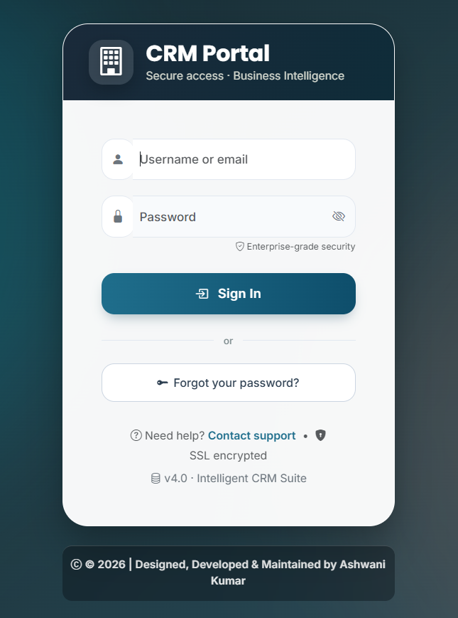
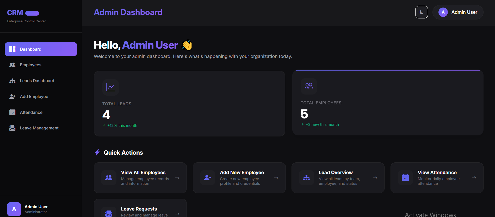
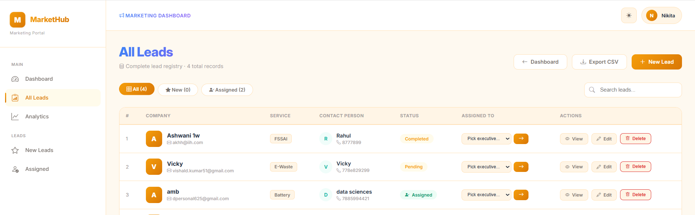
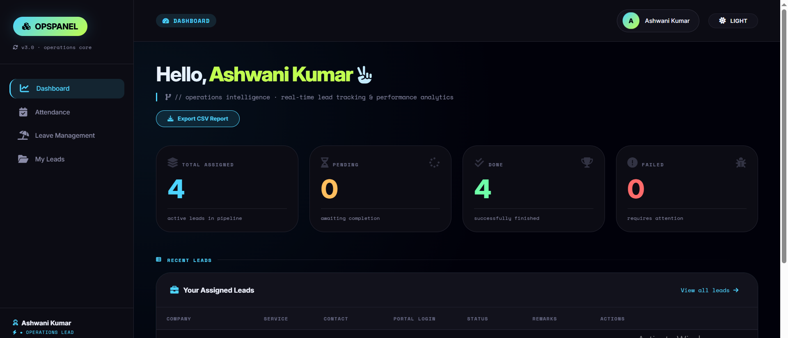
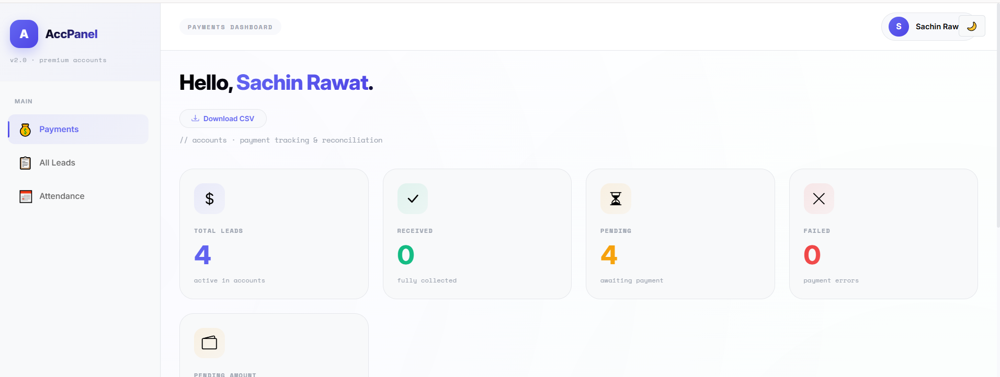
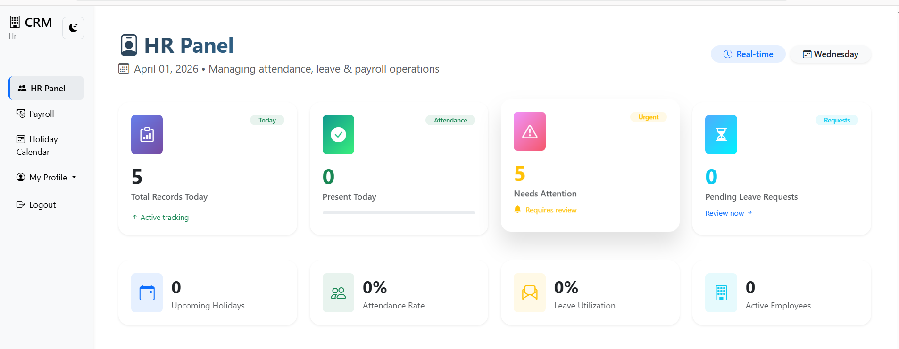
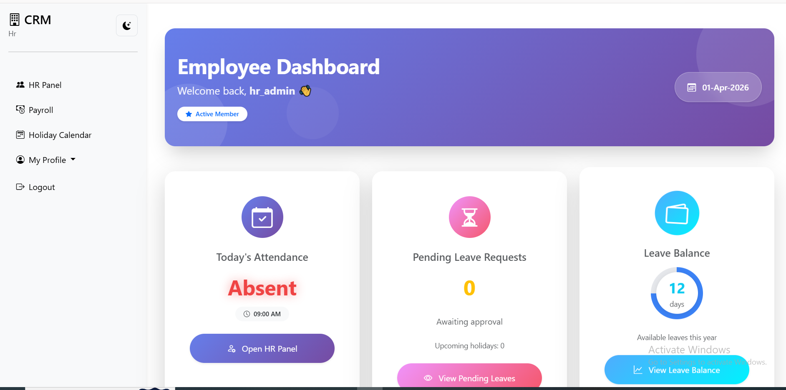
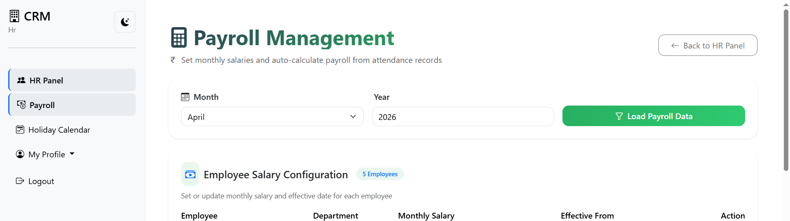

# 🚀 Flask CRM System

A role-based **Customer Relationship Management (CRM)** web application built using **Flask**, **MySQL**, and **Bootstrap**.  
This system helps manage leads across **Marketing**, **Operations**, **Accounts**, and **HR** teams with admin-level control.

---

# ✨ Features

## 👤 Authentication
- Secure login system  
- Role-based access control  
- Admin / Marketing / Operations / Accounts dashboards  
- Password change functionality  

## 📊 Lead Management
- Create and manage leads  
- Assign leads to employees  
- Track lead status  
- Department-wise lead tracking  

## 🔄 Workflow Automation
- Marketing → Operations auto transfer  
- Operations → Accounts auto transfer  
- Stage-wise pipeline tracking  
- Lead status updates  

## 👨‍💼 Admin Panel
- View all employees  
- Employee-wise dashboard  
- Department-wise dashboards  
- Manual lead assignment  

## 💰 Accounts Module
- Payment status update  
- Closed deal tracking  
- Revenue tracking  
- Profit reporting  

## 📈 Dashboard & Reports
- Employee-wise dashboard  
- Department dashboard  
- Monthly report  
- Profit report  

## 🕒 Attendance Management
- Daily employee attendance tracking  
- Admin attendance control  
- Present / Absent marking  
- Employee-wise attendance history  
- Department-wise attendance view  

## 🏖️ Leave Management
- Apply for leave  
- Admin leave approval / rejection  
- Leave status tracking  
- Leave history  
- Employee-wise leave records  

## 💵 Payroll Management
- Employee salary management  
- Monthly payroll generation  
- Attendance-based salary calculation  
- Payroll records tracking  
- Payment status update  

---

# 🛠️ Tech Stack

**Backend**
- Python
- Flask
- Flask-Login

**Frontend**
- HTML
- CSS
- Bootstrap
- Jinja2

**Database**
- MySQL

---

# 📁 Project Structure

---

# 🔐 User Roles

- Admin  
- Marketing  
- Operations  
- Accounts  
- HR (Attendance & Payroll Management)

---

# 📌 Use Case

This CRM system is useful for:

- Sales team management  
- Lead tracking  
- Business workflow automation  
- Employee attendance tracking  
- Leave management system  
- Payroll management system  
- Internal office management  

---

# 📷 Screenshots

- Login page  

- Admin dashboard  

- Marketing dashboard  

- Operations dashboard  

- Accounts dashboard  

- HR Admin Dashboard  

- Attendance Management  

- Payroll Management  

---

# 📄 License
This project is licensed under the MIT License.

---

# 👨‍💻 Author

**Ashwani Kumar**  
Flask Developer | Data Science & Machine Learning Engineer